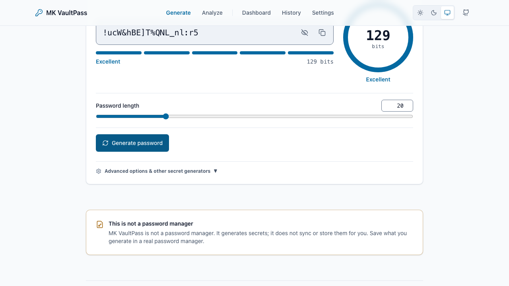

# MK VaultPass

A local-first toolkit for generating passwords, passphrases, PINs, tokens, and recovery codes — every secret is made in your browser and never leaves it.

[](LICENSE)
[](https://nextjs.org)
[](https://www.typescriptlang.org)

## Live

- Production: **[vaultpass.mkazi.live](https://vaultpass.mkazi.live)** — _DNS pending; the custom domain is being wired up._
- Current deployment: **[mk-vaultpass.vercel.app](https://mk-vaultpass.vercel.app)**
- Repository: [github.com/mk-knight23/36-tool-react-password-generator](https://github.com/mk-knight23/36-tool-react-password-generator)

## What it does

MK VaultPass is a local-first security toolkit. It generates passwords,
passphrases, PINs, API tokens, and recovery codes, and it analyzes any secret
for entropy and strength. Everything is produced with the browser's Web Crypto
API, so the values it makes never travel to a server.

It is **not a password manager**. It does not sync, and it does not store what
you generate unless you explicitly turn on local history. Generate a secret
here, then save it in a real password manager.

## Features

Everything below is deterministic and runs entirely on your device. The only
part that can reach the network is the optional AI explainer, called out at the
end.

- **Nine generators**, all client-side:
  - **Password** — length 8–128, per-character-set toggles, "must include" and
    "exclude" rules, exclude-ambiguous characters, and an optional guarantee of
    at least one character per selected set (satisfied by rejection sampling,
    never by biased splicing).
  - **Passphrase** — the bundled EFF large wordlist (7,776 words), 3–10 words,
    configurable separators, capitalization, and appended digits.
  - **Pronounceable** — whole-syllable patterns that are easier to say and
    recall; entropy is reported as a clearly labelled estimate.
  - **PIN** — 4–12 digits with optional rejection of trivial sequences; entropy
    is reported honestly (a 4-digit PIN is weak — device lockout is the real
    defence).
  - **UUID v4** — RFC 4122 identifiers from `crypto.randomUUID`.
  - **Random string** — arbitrary length over named or custom alphabets.
  - **API token** — byte-accurate hex, base64url, or prefixed keys.
  - **Recovery codes** — printable backup-code sheets for 2FA.
  - **Wi-Fi password** — WPA2/WPA3-aware keys, capped at 63 characters.
- **Bulk mode** — generate 2–100 values at once for any generator.
- **Analyzer** — local entropy, pattern detection, a bundled common-password
  check, and policy-compliance scoring, with no network calls.
- **Policy builder / validator** — compose a password policy and test candidate
  secrets against it.
- **Interactive checklists** — security checklists whose progress is saved
  locally.
- **Opt-in history and dashboard** — off by default; when enabled, generated
  values are stored only in your browser's IndexedDB and summarized on a local
  dashboard.
- **Content library** — long-form guides and use-case pages (entropy, passphrase
  vs. password, recovery codes, API token formats, Wi-Fi, and more).
- **Strict Content-Security-Policy** — the default policy is `connect-src 'self'`,
  so the browser can only talk back to this origin. A unit test asserts
  `Math.random` appears nowhere in `src/`; all randomness is Web Crypto.
- **Optional AI explainer** _(only networked feature)_ — a single API route
  (`POST /api/ai/explain`) that explains concepts through the Vercel AI Gateway.
  Its request schema has no field that can carry a secret, a client-side guard
  refuses secret-shaped questions before any request, and the server
  re-validates. With no gateway credential configured it returns a graceful
  fallback and the UI shows the built-in, clearly-labelled non-AI explanation.

## Screenshots



_Captured by the Playwright smoke test (`e2e/smoke.spec.ts`)._

## Tech stack

- **Next.js** (App Router, `src/` layout)
- **TypeScript** in strict mode
- **Tailwind CSS v4** for styling
- **IndexedDB** via `idb` for the opt-in local history store (local-first; no
  server storage)
- **Vercel AI Gateway** (through the `ai` SDK) for the optional AI explainer
- `lucide-react` icons, `zod` for API input validation
- **Vitest** + Testing Library for unit tests, **Playwright** for the smoke suite

No database, no accounts, no signup. The only persistence is in the visitor's
browser (IndexedDB for opt-in history, `localStorage` for tiny non-secret
preferences).

## Project structure

```
.
├── src/
│   ├── app/                     # Next.js App Router: routes, layout, metadata
│   │   ├── layout.tsx           # Root layout, theme boot, global chrome
│   │   ├── page.tsx             # Home / landing
│   │   ├── generate/            # Main generator workspace
│   │   ├── analyze/             # Standalone secret analyzer
│   │   ├── policies/            # Password-policy builder & validator
│   │   ├── checklists/          # Interactive security checklists
│   │   ├── history/             # Opt-in local generation history
│   │   ├── dashboard/           # Local summary of history/usage
│   │   ├── settings/            # Client preferences, BYOK AI key, consent
│   │   ├── guides/[slug]/       # Long-form how-to guides (static content)
│   │   ├── use-cases/[slug]/    # Use-case walkthroughs (static content)
│   │   ├── docs/ faq/ changelog/ open-source/  # Reference & meta pages
│   │   ├── about/ creator/ contact/            # About / creator / contact
│   │   ├── privacy/ terms/ cookies/ policies/  # Legal & policy pages
│   │   ├── api/ai/explain/route.ts  # Only server route: optional AI explainer
│   │   ├── error.tsx loading.tsx not-found.tsx # App-level UX states
│   │   ├── robots.ts sitemap.ts opengraph-image.tsx  # SEO / social metadata
│   │   └── globals.css          # Tailwind entry + design tokens
│   │
│   ├── components/              # React components, grouped by domain
│   │   ├── ui/                  # Primitives: Button, Card, Field, Modal, …
│   │   ├── shell/               # Nav, Footer, ThemeToggle (app frame)
│   │   ├── product/             # Generator UI: SecretOutput, EntropyRing,
│   │   │                        #   StrengthBar, CopyButton, MiniGenerator
│   │   ├── workspace/           # The generator workspace + per-mode controls
│   │   ├── analyze/             # Analyzer view
│   │   ├── policies/            # Policy builder view
│   │   ├── checklists/          # Checklists view
│   │   ├── history/             # History view
│   │   ├── dashboard/           # Dashboard view
│   │   ├── settings/            # Settings view
│   │   ├── ai/                  # AiExplainPanel (optional AI UI)
│   │   ├── content/             # Article layout, prose, breadcrumbs, JSON-LD
│   │   └── analytics/           # Consent banner/controls, GTM script (gated)
│   │
│   ├── lib/                     # Framework-free core logic
│   │   ├── crypto/random.ts     # Web Crypto RNG + rejection sampling (no bias)
│   │   ├── generators/          # One module per generator (password, passphrase,
│   │   │                        #   pin, uuid, apiToken, recoveryCodes, wifi, …)
│   │   ├── analysis/            # Entropy, patterns, strength, policy, common-pw
│   │   ├── ai/                  # AI client, prompt, schema, secret-guard,
│   │   │                        #   rate-limit, quota, BYOK (all secret-safe)
│   │   ├── storage.ts           # IndexedDB (idb) opt-in history store
│   │   ├── settings.ts theme.ts # localStorage preferences & theme
│   │   ├── copy.ts download.ts  # Clipboard & file-download helpers
│   │   ├── analytics.ts         # Consent-gated event helper (no secrets)
│   │   ├── seo.ts jsonld.ts nav.ts site.ts  # Metadata, structured data, config
│   │   └── cn.ts client-hooks.ts            # Small shared utilities
│   │
│   ├── content/                # Static content as typed data
│   │   ├── guides/             # Guide articles (index + one file per guide)
│   │   ├── use-cases/          # Use-case articles (index + one per case)
│   │   ├── checklists.ts faq.ts changelog.ts blocks.ts  # Structured content
│   │   └── types.ts            # Content model types
│   │
│   └── data/                   # Bundled datasets
│       ├── eff-large-wordlist.json   # 7,776-word EFF list for passphrases
│       └── common-passwords.json     # Common-password list for the analyzer
│
├── e2e/smoke.spec.ts           # Playwright smoke (asserts zero egress, G3)
├── public/                     # Static assets (icons, security.txt, llms.txt)
├── docs/                       # Deep-dive documentation (see below)
├── next.config.ts              # Security headers + CSP
└── package.json                # Scripts & dependencies
```

Unit tests live next to the code they cover as `*.test.ts` files (230 tests
across the `lib/` core).

## Getting started

**Prerequisites:** Node.js 20+ and [pnpm](https://pnpm.io).

```bash
pnpm install      # install dependencies
pnpm dev          # start the dev server on http://localhost:3000
pnpm build        # production build (next build)
pnpm test         # run the unit suite (vitest)
```

Other useful scripts:

```bash
pnpm typecheck        # tsc --noEmit
pnpm lint             # eslint
pnpm test:coverage    # vitest run --coverage
pnpm test:e2e         # Playwright smoke (build first)
```

The core product needs no environment variables and no API keys to run.

## Environment variables

Copy `.env.example` to `.env.local`. **Every variable is optional** — with none
of them set, generation, analysis, policies, checklists, history, and the
dashboard all work, and the AI route degrades to its built-in non-AI
explanation.

| Variable | Purpose | Required |
|---|---|---|
| `NEXT_PUBLIC_SITE_URL` | Canonical / Open Graph / sitemap origin. Defaults to the production domain. | No |
| `NEXT_PUBLIC_GTM_ID` | Google Tag Manager container id. Unset ⇒ analytics fully off (no script loads). | No |
| `NEXT_PUBLIC_ADSENSE_ENABLED` | Ad-slot flag; prepared but off. | No |
| `AI_GATEWAY_API_KEY` | Vercel AI Gateway key for the optional AI route (self-host / local dev). | No |
| `AI_MODEL` | Gateway model slug for most AI topics. | No |
| `AI_MODEL_QUALITY` | Gateway model slug for the policy-explanation topic. | No |

On Vercel, the AI route can also authenticate through the automatically-injected
`VERCEL_OIDC_TOKEN`, or through a user's own key sent per-request (BYOK) from
Settings — that key is never logged or stored server-side.

## Privacy

Nothing you generate leaves your device. Secrets are produced with the Web
Crypto API in the browser; the strict CSP (`connect-src 'self'`) means the page
can only talk back to its own origin. Generation history is off by default and,
when enabled, is stored only in your browser's IndexedDB. Analytics is
consent-gated and off by default; even when enabled it may only ever receive
event names, mode names, and bucketed counts — never a generated value. Full
detail in [`docs/PRIVACY.md`](docs/PRIVACY.md).

## Deployment & launch guide

### Recommended platform: Vercel

Vercel is the path this project uses, for a few concrete reasons:

- It is the native host for Next.js — the App Router, image handling, and build
  pipeline work with zero configuration.
- The AI explainer is a serverless route, and Vercel runs it (and injects
  `VERCEL_OIDC_TOKEN` for the AI Gateway) without extra setup.
- The free/hobby tier covers this app, and every push gets a preview deployment.

### Deploy it

1. **Fork or clone** this repository to your own GitHub account.
2. In [Vercel](https://vercel.com/new), **import** the repository. Vercel detects
   Next.js automatically — no build settings to change.
3. **Set environment variables** (all optional). To enable the AI explainer, add
   `AI_GATEWAY_API_KEY` (or rely on Vercel OIDC). Leave everything blank for a
   fully-working deterministic deployment.
4. **Deploy.** The first build produces a live URL like `mk-vaultpass.vercel.app`.

### Add the custom domain

1. In the Vercel project, open **Settings → Domains** and add
   `vaultpass.mkazi.live`.
2. At the DNS provider for `mkazi.live` (**Cloudflare**), add an `A` record:

   ```
   Type: A   Name: vaultpass   Value: 76.76.21.21
   ```

   (If Cloudflare proxying is on, set the record to **DNS only / grey cloud** so
   Vercel can issue the certificate.)
3. Vercel verifies the record and **auto-issues the SSL certificate**. Once DNS
   propagates, `https://vaultpass.mkazi.live` serves the app.

### Future: a standalone domain

The candidate standalone domain is **mkvaultpass.com**. To move there later: buy
the domain, add it in **Settings → Domains** on the same Vercel project, point
its DNS at Vercel, and make it the primary domain. Keep `vaultpass.mkazi.live`
attached and set a redirect from the subdomain to the new apex so existing links
keep working.

More detail and the production verification checklist live in
[`docs/DEPLOYMENT.md`](docs/DEPLOYMENT.md).

## Documentation

Deeper documentation lives in [`docs/`](docs/):

- [`ARCHITECTURE.md`](docs/ARCHITECTURE.md) — system design and the zero-egress boundary.
- [`AI_ARCHITECTURE.md`](docs/AI_ARCHITECTURE.md) — how the optional AI route stays secret-safe.
- [`SECURITY.md`](docs/SECURITY.md) — threat model, CSP, and disclosure policy.
- [`PRIVACY.md`](docs/PRIVACY.md) — what is (and isn't) stored, and where.
- [`DATABASE.md`](docs/DATABASE.md) — the browser-only IndexedDB store.
- [`DEPLOYMENT.md`](docs/DEPLOYMENT.md) — deploy and verification steps.
- [`PRODUCT_SPEC.md`](docs/PRODUCT_SPEC.md) — the full product specification.
- [`DESIGN_SYSTEM.md`](docs/DESIGN_SYSTEM.md) — tokens, components, and UI rules.
- [`TEST_REPORT.md`](docs/TEST_REPORT.md) — latest local test and coverage results.
- Planning notes: [`ANALYTICS_PLAN.md`](docs/ANALYTICS_PLAN.md), [`SEO_PLAN.md`](docs/SEO_PLAN.md), [`MONETIZATION_PLAN.md`](docs/MONETIZATION_PLAN.md), [`AUDIT.md`](docs/AUDIT.md).

## Roadmap

Honest near-term items:

- Wire the AI Gateway key end-to-end and document the BYOK flow in the UI.
- Write more guides and use-case pages for the content library.
- QR rendering for Wi-Fi passwords (local-only, clearly labelled).
- Optional local breach-check tooling beyond the bundled common-password list.
- Additional export formats for recovery-code sheets.

## About the creator

Built and maintained by **Kazi Musharraf** — AI Engineer · Full-Stack Developer ·
Open-Source Builder.

- GitHub: [github.com/mk-knight23](https://github.com/mk-knight23)
- Portfolio: [mkazi.live](https://www.mkazi.live)

## License

MIT © 2026 Kazi Musharraf. See [`LICENSE`](LICENSE).

---

Built and maintained by Kazi Musharraf. Open source for everyone.
